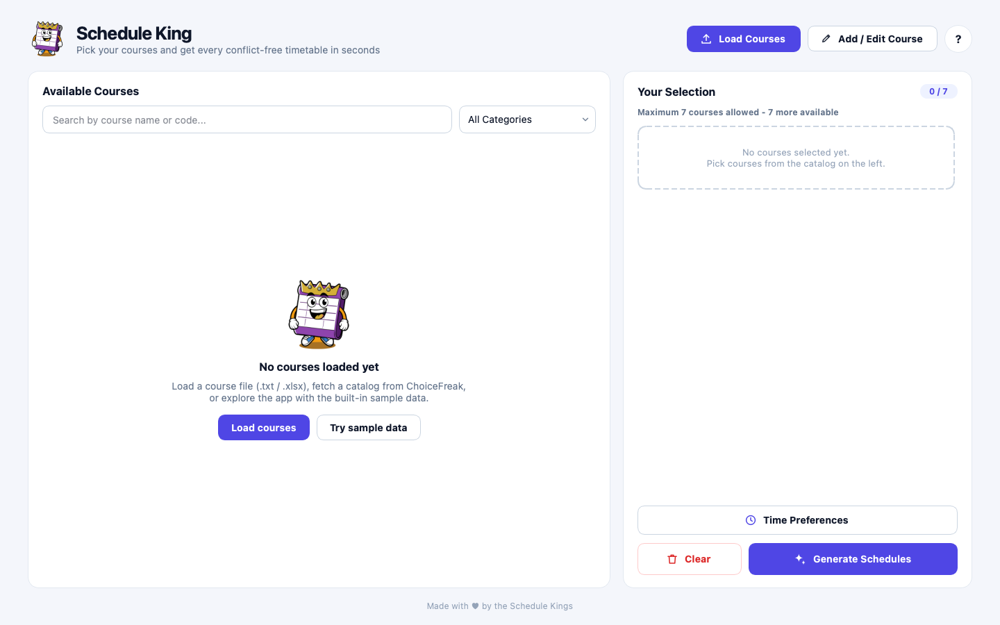
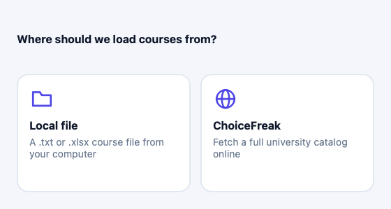
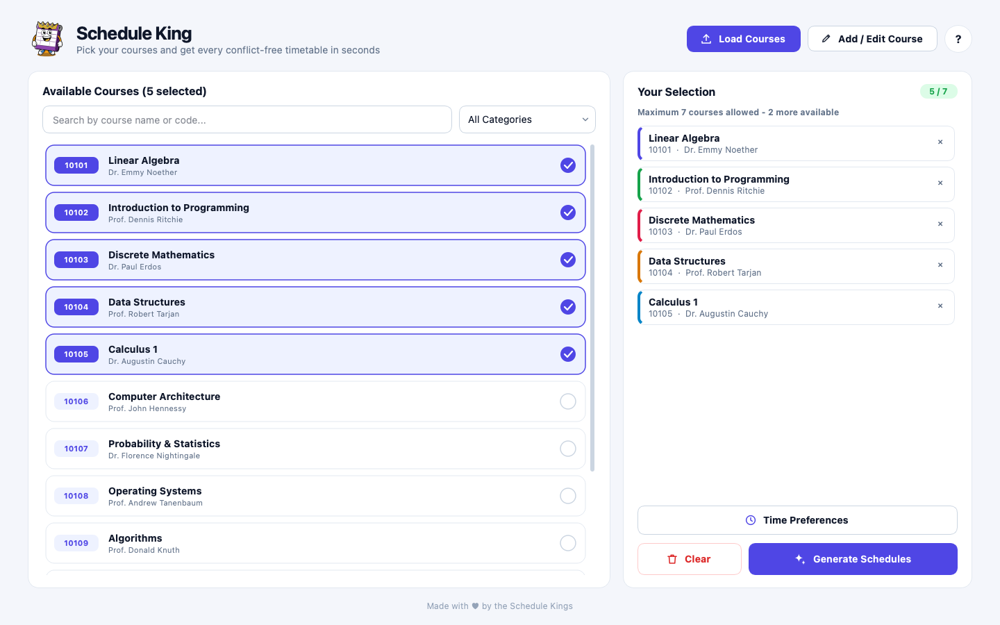
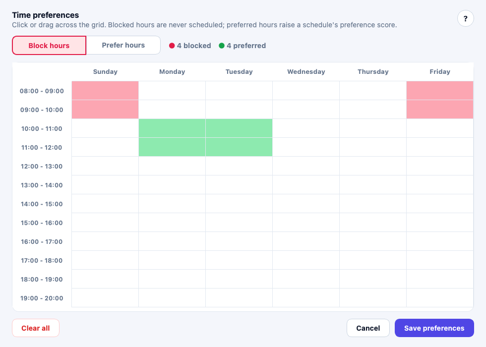
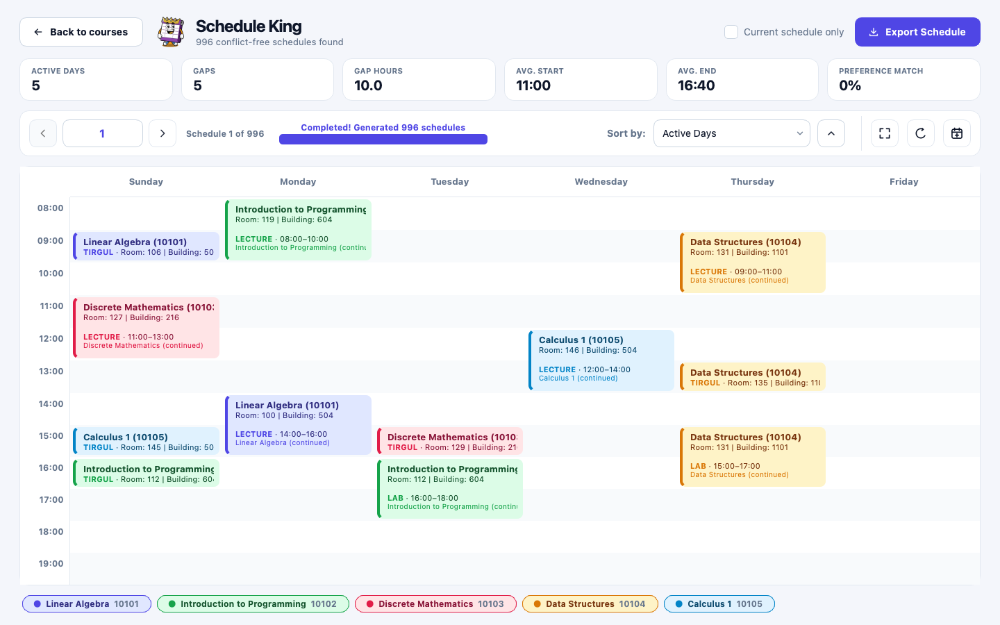

<p align="center">
  
</p>

<h1 align="center">Schedule King</h1>

<p align="center">
  Pick your courses and get <b>every conflict-free timetable</b> in seconds - then rank, compare and export them.
</p>

<p align="center">
  
</p>

---

## Quick start - one command

```bash
./run.sh            # macOS / Linux
run.bat             # Windows
```

The first run creates a virtual environment, installs the dependencies and launches the app. Later runs start immediately.

| Command | What it does |
|---|---|
| `./run.sh` | Set up (first time only) and launch the app |
| `./run.sh --sample` | Launch with the bundled sample catalog already loaded |
| `./run.sh test` | Run the full test suite headless |
| `./run.sh screenshots` | Regenerate the screenshots in `docs/screenshots` |
| `./run.sh setup` | Only create or update the virtual environment |

**Requirements:** Python 3.8 or newer ([python.org](https://www.python.org/downloads/)). Everything else is installed automatically.

<details>
<summary>Manual setup (without the script)</summary>

```bash
cd Schedule-King
python3 -m venv .venv
.venv/bin/pip install -r requirements.txt     # Windows: .venv\Scripts\pip ...
.venv/bin/python main.py                       # add --sample to preload demo data
```
</details>

---

## Screenshots

| Start screen | Choose a course source |
|---|---|
|  |  |

| Course selection | Time preferences |
|---|---|
|  |  |

| Generated schedules | Ranked by a metric |
|---|---|
|  |  |

---

## Features

- **Load courses your way:** a local `.txt` / `.xlsx` file, the online ChoiceFreak catalog, or the built-in **sample data**.
- **Search and filter** by name, code or category, with up to 7 courses per plan.
- **Time preferences:** click or drag over the week grid to *block* hours (never scheduled) or *prefer* hours (raises the preference score).
- **Every conflict-free combination:** generated in a background process with live progress.
- **Rank schedules** by active days, number of gaps, gap hours, average start / end time, or preference match, ascending or descending.
- **Readable timetable:** each course has its own colour with a matching legend, and you get metric tiles for the current schedule plus a full-screen view.
- **Export** to text, Excel (one styled sheet per schedule) or straight to Google Calendar.

## How to use

1. **Load courses:** click *Load Courses* (or *Try sample data* on the start screen).
2. **Select courses:** click courses in the catalog. They appear under *Your Selection*, and the `✕` button removes one.
3. **(Optional) Time preferences:** block or prefer hours.
4. **Generate Schedules:** browse with the arrows, jump to a number, or sort by a metric.
5. **Export:** save the current schedule (or the next 100) to `.txt` / `.xlsx`, or send it to Google Calendar.

---

## Course file format (`.txt`)

Courses are separated by `$$$$`. Each block has the name, code, instructor, and one line per session option:

```
<Type> S,<Day>,<Start>,<End>,<Room>,<Building>
```

- **Type:** `L` lecture, `T` tirgul (tutorial), `M` maabada (lab)
- **Day:** `1` = Sunday ... `6` = Friday. Times use 24-hour format.
- A session that meets more than once a week lists several `S,...` groups on the same line.

```
$$$$
Linear Algebra
10101
Dr. Emmy Noether
L S,2,14:00,16:00,100,504
L S,3,08:00,10:00,108,504
T S,1,09:00,10:00,106,504
T S,4,09:00,10:00,103,504
```

A full example lives in [`Schedule-King/sample_data/sample_courses.txt`](Schedule-King/sample_data/sample_courses.txt), and more are in `Schedule-King/tests/test_files/`.

---

## Project structure

```
schedule-king/
├── run.sh / run.bat          # one-command setup + launch
├── docs/screenshots/         # images used in this README
└── Schedule-King/
    ├── main.py               # entry point (--sample, --windowed)
    ├── requirements.txt
    ├── sample_data/          # bundled demo course catalog
    ├── tools/                # take_screenshots.py (headless renderer)
    ├── src/
    │   ├── styles/           # theme.py (design tokens + global stylesheet), icons.py (vector icons)
    │   ├── views/            # course selection and schedule windows
    │   ├── components/       # reusable widgets (course list, timetable, dialogs, ...)
    │   ├── controllers/      # app flow and background workers
    │   ├── models/           # Course, TimeSlot, Schedule, ranking
    │   └── services/         # parsing, scheduling, export, ChoiceFreak, Google Calendar
    └── tests/                # pytest suite (runs headless)
```

## Testing

```bash
./run.sh test
```

Qt tests run with the `offscreen` platform, so no windows open during the run.

---

<p align="center">Made with ♥ by the Schedule Kings</p>
